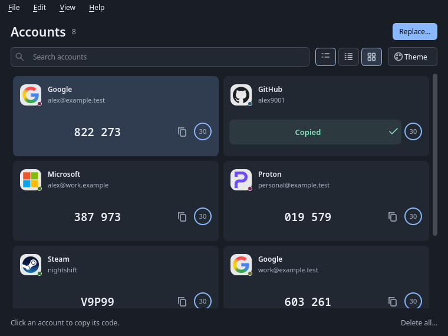
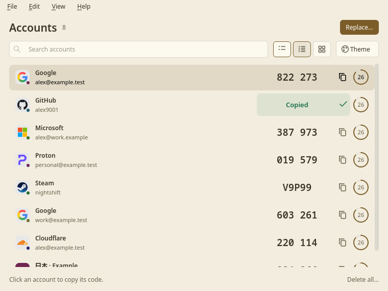
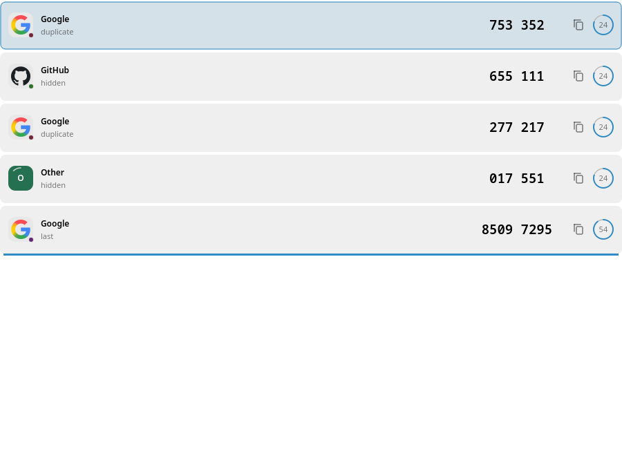

<p align="center">
  
</p>

<h1 align="center">Aeris</h1>

<p align="center">
  <strong>Your authenticator codes, at home on your desktop.</strong><br>
  A native, offline viewer for phone authenticator exports.<br>
  Your phone remains the source of truth.
</p>

<p align="center">
  <a href="#build-from-source"></a>
  <a href="#build-from-source"></a>
  <a href="#your-codes-stay-local"></a>
  <a href="LICENSE"></a>
</p>

<p align="center">
  <a href="#quick-start">Quick start</a> ·
  <a href="#formats">Supported formats</a> ·
  <a href="docs/interface.md">Interface</a> ·
  <a href="#build-from-source">Build</a> ·
  <a href="https://github.com/Alex9001/Aeris/releases">Releases</a> ·
  <a href="https://github.com/Alex9001/Aeris/issues">Issues</a>
</p>



<p align="center"><sub>The actual desktop app. All accounts and codes pictured use synthetic test data.</sub></p>

## Find it. Copy it. Get back to work.

Bring an authenticator export to your desktop and keep the code you need within reach. Search by service or account, recognize familiar logos, and copy with a click. Aeris works offline, with an encrypted collection protected by your operating system's keyring.

| At your fingertips | In Aeris |
| --- | --- |
| Fast code access | Search accounts, click to copy, or use Enter and Ctrl/Cmd+C |
| Familiar services | 2,964 bundled service logos, with colored badges for unknown issuers |
| Your preferred order | Drag and drop accounts; order persists across restarts |
| Room to breathe | List, Compact, and responsive Cards layouts |
| A comfortable desktop | Nine appearance choices, from Midnight and Ocean to Paper |
| Clear feedback | Live countdowns, an inline copied checkmark, and clipboard clearing after 30 seconds |
| Local storage | One encrypted collection secured by the system keyring; source exports remain untouched |

## Quick start

1. **Open Aeris.** Unlock your system keyring if prompted.
2. **Import your export.** Choose **Import…** or drop export files onto the window. Select all parts of a Google multipart export together.
3. **Review and confirm.** Check the account count and any excluded token types. Each import replaces the entire Aeris collection.
4. **Copy a code.** Search by issuer or account, then click a row or press Enter. Drag accounts to arrange them in your preferred order.

Use the layout buttons or **Ctrl/Cmd+1–3** to switch views. The **Theme** menu remembers your appearance choice. Clipboard clearing leaves content copied by another application alone.

## Make it feel like your desktop

Choose System, Light, Dark, Midnight, Ocean, Forest, Violet, Rose, or Paper. All three layouts share the same accounts, service logos, countdowns, and copy feedback.

<table>
  <tr><th width="50%">Paper · Compact</th><th width="50%">Drag to reorder</th></tr>
  <tr>
    <td><a href="docs/screenshots/paper-compact.png"></a></td>
    <td><a href="docs/screenshots/reorder.png"></a></td>
  </tr>
</table>

[Explore the interface →](docs/interface.md)

## Your codes stay local

Aeris reads exports from your phone authenticator and stores one encrypted snapshot. It does not synchronize changes back to your phone. Service artwork ships with the application and needs no network requests.

A working Secret Service or KWallet is required on Linux; there is no plaintext key fallback. **Delete all…** removes Aeris's imported snapshot and saved credentials after confirmation. Your original export files are never modified. Closing the window exits the app; an active save finishes before closing.

[Storage design and recovery →](docs/architecture.md)

## Formats

| Source | Exports |
| --- | --- |
| Aegis | Plain and password-encrypted JSON |
| Google Authenticator | Migration links in text files; PNG/JPEG migration screenshots; complete multipart batches |
| Raivo OTP | JSON and password-protected ZIP |
| 2FAS | Plain and password-encrypted `.2fas`, schemas 1–4 |
| Ente Auth | Plain OTP-link text and password-encrypted exports |
| Bitwarden Authenticator | Android/iOS JSON and CSV |
| Proton Authenticator | Plain and password-encrypted JSON v1 |
| andOTP | Plain JSON; current and legacy password-encrypted backups |
| Other authenticators | Text files containing `otpauth://` export links |

TOTP supports SHA-1, SHA-256 and SHA-512, 1–10 digits, and source periods of 1–86400 seconds. Steam codes are supported. HOTP and other token types are named in the exclusion review; importing a supported subset requires confirmation. Failed passwords, invalid supported entries, unknown versions, incomplete Google batches and empty imports keep the existing collection.

Select every file in a Google multipart export together. Ordinary enrollment QR images, password-manager vaults, service-connected cloud backups and PGP-encrypted andOTP exports are outside this release. See [format details and upstream references](docs/formats.md) for limits and known export quirks.

## Build from source

C++20, CMake 3.24+, Ninja, Qt 6.4+ Widgets, OpenSSL 3, libsodium, libzip, ZXing-C++, protobuf-lite/protoc and QtKeychain for Qt 6 are required.

Ubuntu 24.04:

```sh
sudo apt install cmake ninja-build pkg-config g++ qt6-base-dev qtkeychain-qt6-dev qt6-wayland \
  libssl-dev libsodium-dev libzip-dev libzxing-dev libprotobuf-dev protobuf-compiler
cmake -S . -B build -G Ninja -DCMAKE_BUILD_TYPE=Release
cmake --build build --parallel
ctest --test-dir build --output-on-failure
./build/aeris
```

On Arch/Artix, the library packages are `qt6-base qt6-keychain qt6-wayland openssl libsodium libzip zxing-cpp protobuf`. A working Secret Service or KWallet is required to save or reopen imported accounts; there is no plaintext key fallback. Unlock the keyring and select **Retry** if unavailable.

[Release instructions](docs/releases.md) cover Windows/macOS builds, bundled dependencies, AppImages, per-user NSIS installers, portable ZIPs, universal DMGs and the AUR source recipe. Packages are initially unsigned by a publisher. Linux amd64 has been built and smoke-tested locally; native Windows/macOS acceptance is still pending. See the release page for any published packages.

## Documentation and development

| Guide | Covers |
| --- | --- |
| [Interface](docs/interface.md) | Layouts, themes, service logos, copying, and account order |
| [Import formats](docs/formats.md) | Supported exports, limits, and upstream references |
| [Architecture](docs/architecture.md) | Models, encrypted storage, keyring ownership, and recovery |
| [Verification](docs/verification.md) | Tests, measured results, and platform acceptance |
| [Releases and packaging](docs/releases.md) | Dependencies, AppImages, installers, archives, and release checks |
| [Application artwork](docs/branding.md) | The A-Shield master and platform icon generation |

Tests use synthetic secrets only. Regenerate fixtures with `python scripts/fixtures.py` after installing `scripts/requirements.txt` in a virtual environment. `scripts/lint.py` enforces Lizard 1.17.31 cyclomatic complexity ≤10 and clang-tidy cognitive complexity ≤15 for maintained C++ functions. CI additionally runs ASan/UBSan and libFuzzer.

## License

**MIT** · © 2026 Aleksandr Oreshkin · CYBER FRACTURE

See [LICENSE](LICENSE) and [third-party notices](THIRD_PARTY_NOTICES.md). Bundled service logos retain their respective licenses and owners' rights.

<p align="center">
  <a href="https://cyberfracture.com">CYBER FRACTURE</a> ·
  <a href="https://github.com/Alex9001/Aeris">Source</a> ·
  <a href="https://github.com/Alex9001/Aeris/releases">Releases</a>
</p>
