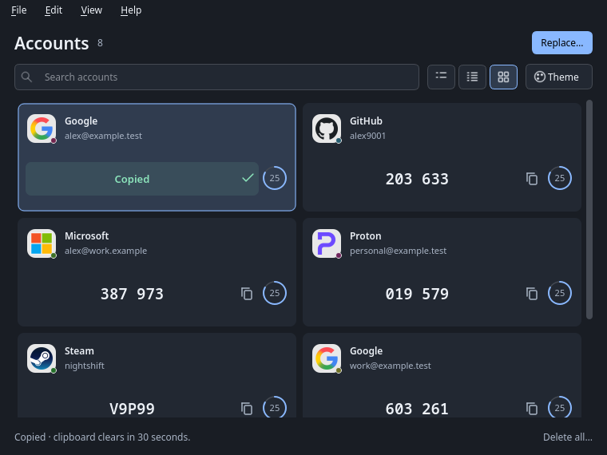

# Interface

The native Qt interface uses slim controls, subtle focus outlines, explicit input/text colors, and a complete palette for each theme. TodoBench's local desktop implementation was reviewed as a behavior/design reference for coherent palettes, density choices and saved appearance. Aeris's implementation is independently written under MIT.

The toolbar exposes three layouts immediately: List for a balanced view, Compact for more accounts, and Cards for a grid that adjusts to the window width. The same choices are in View → Layout, with Ctrl/Cmd+1–3 shortcuts. Selection and keyboard navigation use Qt's list model; accounts do not allocate individual widgets.

Theme choices are System, Light, Dark, Midnight, Ocean, Forest, Violet, Rose and Paper. Theme and layout persist between launches. System retains the platform widget style; named themes use Qt's Fusion style with complete palettes. Search, menus, selection, buttons, dialogs and account surfaces receive matching foreground/background colors. Focus outlines remain visible for keyboard navigation.

Click anywhere on an account to copy its current OTP code. The code area briefly shows an animated checkmark and “Copied”, then returns to the code. Enter and Ctrl/Cmd+C on an account provide the same feedback. Codes may be grouped visually for reading; the clipboard receives the unspaced code. Copying still recalculates at the current time and retains the 30-second ownership-aware clipboard clearing.

Drag an account to arrange its position in List, Compact or Cards. A highlighted insertion line shows the destination; in Cards, use the left or right side of a card to insert before or after it. The view scrolls near its top and bottom edges while dragging. Press Escape or release outside the account area to cancel. Dragging does not copy a code; ordinary clicks still do.

Order is saved automatically in the encrypted collection and survives reopening Aeris. The display changes after saving succeeds. Search and copying codes stay available during a save; another reorder, import, or deletion waits until it finishes. Closing during a save keeps the window open until the operation completes. A failed save retains the previous display order and shows an error; after resolving the problem you can drag again. Search text stays in place during reordering. With search active, drop positions refer to visible neighbors (including after the last visible result); hidden accounts keep their relative order. Replacing the collection through import adopts the incoming export’s order.

Recognized issuers automatically show bundled service logos in all layouts. Logos sit on a neutral backing with a small account-specific color dot, so duplicate accounts keep a visual distinction. Unknown or ambiguous issuers retain the initials, stable color and identifying mark badge. Matching ignores case, spaces, hyphens and underscores and uses exact catalog names, identifiers and explicit aliases (including AWS and github.com). Proton and ProtonMail match their respective catalog artwork. Steam tokens always use Steam artwork. Account email addresses and partial names never infer a service.

The 2,949 standard PNGs from selfh.st/icons revision `2053b70b283ffed5f2cc1424d1e17d9c554a846d` plus 15 supplemental service logos are bundled at up to 128×128, with original proportions and colors. No network access, setting or reimport is needed. Missing or unreadable artwork falls back to the badge. Matching is cached when accounts load; an 8 MiB render cache keys on brand, logical size and display scale. Countdown and copy animations reuse that presentation data.

Artwork attribution and CC-BY-4.0 licensing are in `THIRD_PARTY_NOTICES.md` and `licenses/selfhst-icons-CC-BY-4.0.txt`; application code remains MIT. `assets/brands/catalog.json` records source and output checksums. Maintainers can regenerate with `scripts/brand-icons.py <pinned-upstream.tar.gz>` using the pinned Pillow dependency and `rsvg-convert` for supplemental SVG sources. Run `scripts/brand-icons.py` without an archive to refresh explicit aliases and supplemental images. Alias definitions are in `assets/brand-aliases.json`; the retained supplemental source files, URLs, checksums and per-image license status are in `assets/brand-sources`. Supplemental logos retain their respective owners’ rights, as described in `licenses/brand-supplement-NOTICE.md`. Normal CMake builds use only the prepared assets.

Explicit aliases include wordpress.org/wordpress.com, MongoDB/monogodb, Fidelity Investments/fidelity.com, Chase Bank/chase.com, tastyworks/tastytrade, MySonicWall and DWService domains. Additional bundled brands include GoDaddy, Patelco, GOG, DreamHost, Rocket Mortgage, Rocket Money, Spaceship, Zoho, Intuit, Rockstar Games, Ubisoft and ID.me. Matching still uses the issuer alone and does not accept arbitrary subdomains, suffixes or partial names.

## Previews

All accounts in these screenshots are synthetic test data.

